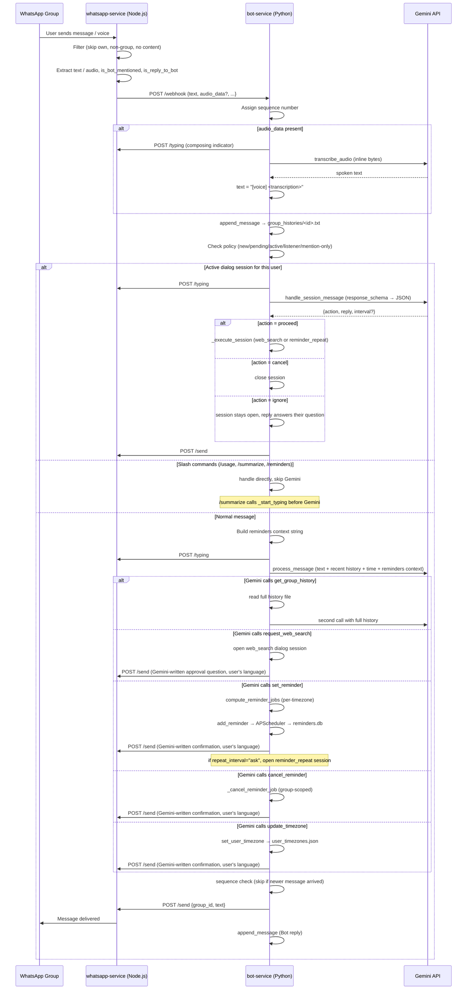

# WhatsApp AI Bot — System Design

## Architecture

```
┌─────────────────────────────────────────────────────────────────────┐
│                          GCP VM (systemd)                           │
│                                                                     │
│  ┌────────────────────────┐       ┌────────────────────────────┐   │
│  │   whatsapp-service     │       │       bot-service           │   │
│  │   Node.js · port 3000  │       │   Python/FastAPI · port 8000│   │
│  │                        │       │                            │   │
│  │  Baileys               │─────▶ │  main.py                   │   │
│  │  (WhatsApp Web proto)  │webhook│  gemini_client.py          │   │
│  │                        │◀───── │  history_manager.py        │   │
│  │  .baileys_auth/        │ /send │  reminders.py              │   │
│  │  (session, persisted)  │       │  policy_manager.py         │   │
│  └────────────────────────┘       │  cost_tracker.py           │   │
│           ▲ ▼                     │  timezone_manager.py       │   │
│      WhatsApp servers             └────────────┬───────────────┘   │
│      (WA Web protocol)                         │                   │
│                                                ▼                   │
│                                    ┌───────────────────────┐       │
│                                    │   gemini-2.5-flash     │       │
│                                    │   (Google AI API)      │       │
│                                    └───────────────────────┘       │
└─────────────────────────────────────────────────────────────────────┘
```

---

## Message Flow



---

## Features

### Core Intelligence
| Feature | How |
|---|---|
| **Answer questions** | Gemini 2.5 Flash with full context window |
| **Real-time info** (weather, news, prices) | GoogleSearch built-in tool — user confirms before searching |
| **Full chat history** | Gemini calls `get_group_history` tool only when needed — lazy load |
| **Voice message support** | Audio downloaded by Baileys, transcribed inline by Gemini, stored as `[voice] <text>` |
| **Multilingual** | Replies in the same language as the incoming message |

### Reminders
| Feature | How |
|---|---|
| **Set reminder** | Natural language → Gemini extracts time + message → confirmation flow |
| **Flexible repeats** | "every Monday and Sunday" → Gemini → `CronTrigger`; "daily/weekly" → `IntervalTrigger` |
| **Timezone-aware** | Each participant fired at their local clock time; multi-job for groups with mixed timezones |
| **Survives restarts** | APScheduler + SQLite (`reminders.db`) |
| **Cancel by description** | "delete the reminder about calling mom" → Gemini picks ID from injected context |
| **List reminders** | `/reminders` — shows time, repeat interval, message |
| **Cancel by ID** | `/reminders cancel #id` |
| **Access control** | Non-Main groups: own reminders only. Main group: all reminders across all groups |

### Group Management
| Feature | How |
|---|---|
| **Policy setup** | Bot notifies Main when added to a new group; admin sets policy (1/2/3) |
| **@mention-only mode** | Policy 1 — only replies when mentioned or replied to |
| **All-messages mode** | Policy 2 — replies to everything |
| **Listener mode** | Policy 3 — reads silently, never replies |
| **Remove/re-add detection** | Handles via `groups.upsert` event (Baileys `action=add` is unreliable for re-adds) |

### Admin Commands (slash)
| Command | Available in | What it does |
|---|---|---|
| `/usage` | Main only | Monthly Gemini call count, tokens, cost — per group breakdown |
| `/summarize` | Any group | Summarizes today's messages; in Main combines all groups |
| `/reminders` | Any group | Lists reminders (own group / all groups from Main) |
| `/reminders cancel #id` | Any group | Cancels by ID (group-scoped; Main can cancel any) |

### Observability
| Feature | How |
|---|---|
| **Cost tracking** | Every Gemini call logged to `cost_logs/YYYY-MM.txt` with group, tier, tokens, USD |
| **History files** | One `.txt` per group in `group_histories/` — full conversation log |
| **Typing indicator** | Sent before Gemini call so users know bot is processing |

---

## Data Flow Map

```
                   ┌─────────────────────────────────┐
                   │         group_policies.json       │
                   │  {group_id: {status, mention_only,│
                   │   listener, name}}                │
                   └────────────┬────────────────────-─┘
                                │ read/write
                                ▼
 WhatsApp ──▶ webhook ──▶ policy_manager.py
                    │
                    ├──▶ history_manager.py ──▶ group_histories/<id>.txt
                    │
                    ├──▶ gemini_client.py ──▶ Gemini API
                    │         │                    │
                    │         └── cost_tracker.py ──▶ cost_logs/YYYY-MM.txt
                    │
                    ├──▶ reminders.py ──▶ reminders.db (APScheduler/SQLite)
                    │         │
                    │         └── fire_reminder ──▶ /send ──▶ WhatsApp
                    │
                    └──▶ timezone_manager.py ──▶ user_timezones.json
```

---

## Group State Machine

```
          Bot added to group
                  │
                  ▼
             ┌─────────┐
             │   new   │◀── Bot removed from group (reset)
             └────┬────┘
                  │ Notify Main, ask for policy
                  ▼
           ┌──────────────┐
           │   pending    │  (bot ignores all messages from this group)
           └──────┬───────┘
                  │ Admin replies 1 / 2 / 3 in Main
          ┌───────┴────────────────────┐
          ▼                            ▼
   ┌─────────────┐              ┌──────────────┐
   │mention_only │              │   listener   │
   │  (policy 1) │              │  (policy 3)  │
   └─────────────┘              └──────────────┘
          ▼                            ▼
   Reply only when            Save history only,
   @mentioned / replied       never reply

   ┌─────────────┐
   │  all msgs   │
   │  (policy 2) │
   └─────────────┘
          ▼
   Reply to everything
```

---

## Reminder Session Flow

```
User: "remind me to call mom at 8pm"
                  │
                  ▼
           Gemini → set_reminder{message, iso_time, repeat_interval, confirmation_message}
                  │
                  ▼
  compute_reminder_jobs (per-timezone, multi-job)
  add_reminder → APScheduler → reminders.db
                  │
                  ▼
  Bot sends confirmation_message (Gemini-written, user's language)
  e.g. "Done! I'll remind you to call mom tonight at 8."
                  │
  if repeat_interval == "ask":
         │
         ▼
  open reminder_repeat dialog session
  Bot sends repeat_question (Gemini-written, user's language)
  e.g. "Should this repeat? Just say how often."
         │
    ┌────┴────────────────────────┐
   no / one-time              frequency given
    │                              │
    ▼                              ▼
  session cancel            resolve_repeat_interval → Gemini
  "Got it, one-time."             │
                           CronTrigger or IntervalTrigger
                           (re-schedules job with repeat)
```

## Dialog Session State Machine

```
                     Normal message
                           │
                           ▼
               session_manager.get(group_id, user_jid)
                    ┌──────┴──────┐
               session?          no session
                    │                 │
                    ▼           check ghost?
            handle_session_message        │
            (response_schema JSON)     ┌──┴──────┐
                    │               ghost &    no ghost
            ┌───────┼───────┐       _is_yes?      │
         proceed  cancel  ignore       │        normal flow
            │       │       │          ▼
            ▼       ▼       ▼    revive_ghost → execute
      _execute   close   session      (5-min timer restarts)
      _session   send    stays open
                farewell  send reply
                          (user's question answered)

Session timeout (5 min):
  close_to_ghost → ghost stored for 120s
  generate_timeout_message → send @mention (user's language)

Ghost window (2 min after timeout):
  User sends yes → revive_ghost → execute immediately
  After 2 min: ghost expires, user must re-trigger
```

---

## File Layout

```
whatsapp-bot/
├── whatsapp-service/
│   ├── index.js              # Baileys connection, HTTP server, message filtering
│   ├── package.json
│   └── .baileys_auth/        # Session (gitignored, local)
│
├── bot-service/
│   ├── main.py               # FastAPI, webhook handler, slash commands, session routing
│   ├── gemini_client.py      # Gemini calls, tool declarations, transcription, timezone
│   ├── session_manager.py    # Dialog sessions (web_search/reminder_repeat), ghost revival
│   ├── history_manager.py    # Append/read group .txt files, asyncio write locks
│   ├── reminders.py          # APScheduler, add/list/cancel, CronTrigger/IntervalTrigger
│   ├── policy_manager.py     # Group states (new/pending/active), mention-only, listener
│   ├── cost_tracker.py       # Per-call cost logging, monthly summary
│   ├── timezone_manager.py   # Per-user IANA timezones, multi-timezone reminder jobs
│   ├── requirements.txt
│   ├── group_histories/      # <group_id>.txt per group (gitignored)
│   ├── cost_logs/            # YYYY-MM.txt per month (gitignored)
│   ├── group_policies.json   # Group status + policy settings
│   ├── user_timezones.json   # JID → IANA timezone
│   └── reminders.db          # APScheduler SQLite store
│
└── memory-bank/              # Living documentation
    ├── design.md             # This file
    ├── overview.md           # Purpose, decisions, known limitations
    ├── whatsapp-service.md   # Baileys details, session, message filtering
    ├── bot-service.md        # Full technical reference (webhook flow, Gemini tools, etc.)
    └── operations.md         # Deployment, QR scan, env vars, troubleshooting
```
